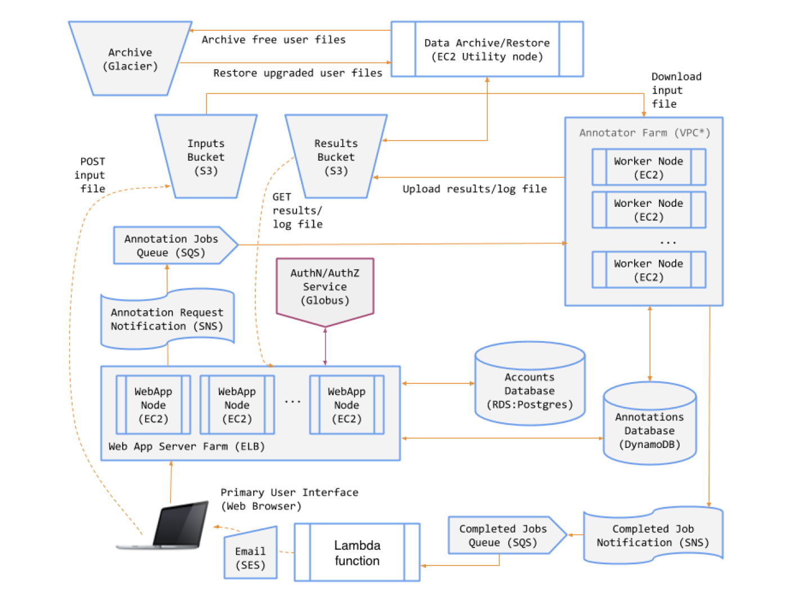
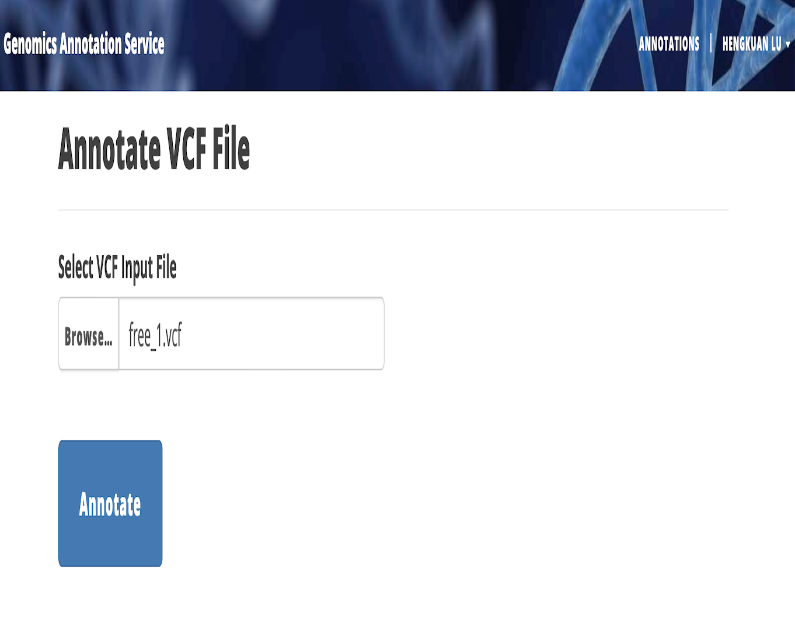
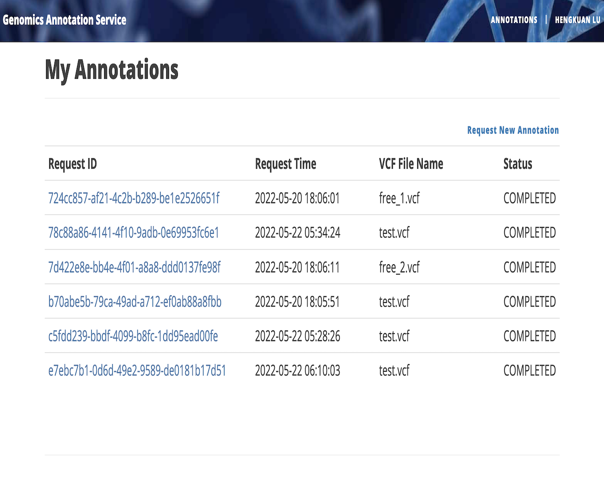
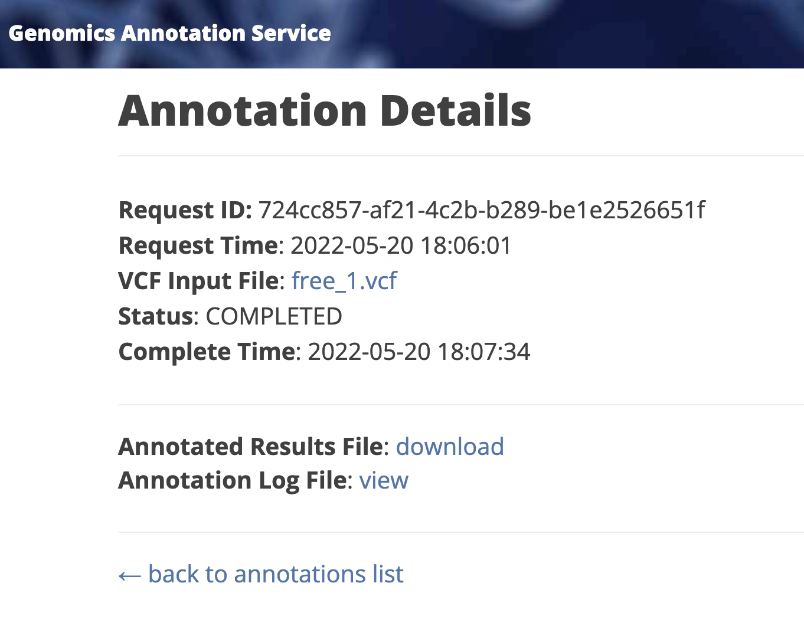

# Intruction
This is a web service deployed on AWS for users to run programs performing annotations of genome sample. Users can upload input files from local devices and then the service will run annotation code, when the tasks is completed, the server will inform users by sending an email. Annotation is a process by which a sequenced genome sample is analyzed to identify the locations of genes and all of the coding regions in a genome, and determine what those genes do. (view [this page](https://www.ncbi.nlm.nih.gov/books/NBK20253/) for explicit definition about the science).

I used [AnnTools](https://github.com/mpcs-cc/anntools), one of the many available open source annotations tools, to perform the analysis. 

# Key Functions

- Log in (via Globus Auth) to use the service -- Some aspects of the service are available only to registered users. Two classes of users will be supported: Free and
Premium. Premium users will have access to additional functionality, beyond that
available to Free users.

- Upgrade from a Free to a Premium user -- Premium users will be required to provide a
credit card for payment of the service subscription. Previously we would integrate with
Stripe for payment processing, but we’ve cut that due to the shortened project timeline.

- Submit an annotation job -- Free users may only submit jobs of up to a certain size.
Premium users may submit any size job. If a Free user submits an oversized job, the
system will refuse it and will prompt the user to convert to a Premium user.

- Receive notifications when annotation jobs finish -- When their annotation request is
complete, the GAS will send users an email that includes a link where they can view the
log file and download the results file.

- Browse jobs and download annotation results -- The GAS will store annotation
results for later retrieval. Users may view a list of their jobs (completed and running).
Free users may download results up to 10 minutes after their job has completed;
thereafter their results will be archived and only available to them if they convert to a Premium user. Premium users will always have all their data available for download.

# System Components

The GAS will comprise the following components:
- An object store for input files, annotated (result) files, and job log files.
- A key-value store for persisting information on annotation jobs.
- A low cost, highly-durable object store for archiving the data of Free users.
- A relational database for user account information.
- A service that runs AnnTools for annotation.
- A web application for users to interact with the GAS.
- A set of message queues and notification topics for coordinating system activity.

## Diagram

## GAS Scalability

The GAS will use elastic compute infrastructure to minimize cost during periods of low demand and to meet expected user service levels during peak demand periods.

- On the front end, the web application will be delivered by multiple servers running within a load balancer. All requests will be received at a single domain name/IP address,
namely that of the load balancer. The load balancer will distribute requests across a pool of identically configured, stateless, web servers running on EC2 instances. At minimum,
the load balancer will have two web server instances running across two availability
zones, providing capacity and ensuring availability in the event of failure. If demand on
either web server exceeds certain thresholds, the GAS will automatically launch
additional web servers and place them in the load balancer pool. When demand remains
below a certain threshold for a specified period of time, the GAS will terminate the
excess web servers.

- On the back end, the annotator service will be delivered by multiple servers (optionally
running within a separate virtual private cloud). At minimum this pool of so-called “worker
nodes” will contain two nodes (EC2 instances). Additional instances will be launched and
added to (or removed from) the worker pool, based on the number of requests in the job
queue.

# gas-framework
An enhanced web framework (based on [Flask](http://flask.pocoo.org/)) for use in the capstone project. Adds robust user authentication (via [Globus Auth](https://docs.globus.org/api/auth)), modular templates, and some simple styling based on [Bootstrap](http://getbootstrap.com/).

Directory contents are as follows:
* `/web` - The GAS web app files
* `/ann` - Annotator files
* `/util` - Utility scripts for notifications, archival, and restoration
* `/aws` - AWS user data files

## Archive process

Every time a user goes to the Annotations page, the GAS system would check the role of the user. If the user is a "free user", GAS would archive all the .annot.vcf file in result bucket to Glacier vault.

1. check the complete time of the job, if past over 5 mins, go to step 2.
2. download the result file from s3 bucket and upload an archive to glacier.
3. update item in DynamoDB, to record storege status ('ARCHIVED') and archive_id.
4. remove the result file from s3 bucket.
5. publish a notification message to the SNS topic. (noted as SNS 1)
6. clean up downloaded file.

note: only job whose result file(.annot.vcf) currently in the results bucket might be archived.

## Restore process

Every time a user goes to the Annotations page, the GAS system would check the role of the user. If the user is a "premium user" (or when a free user subsribbe the premium plan), GAS would restore all the .annot.vcf file from Glacier vault and then upload them to results buckets.

1. recieve messsages from SQS queue (subsribed to SNS1). If has messages, go to step 2.
2. find the archive object from the Glacier with archive_id (from the message received).
3. initiate an archive retrieval job.
4. update item in DynamoDB, to update storege status ('ARCHIVED' to 'RETRIEVING') and store retrieval_job_id.
5. publish a notification message to another SNS topic. (noted as SNS 2)
6. delete the message from SQS.

note: when the storege status of a job is 'RETRIEVING', the Annotation Details page will show a restore messgae -- "The results file is being restored", instead of a download link behind the Annotated Results File tag.

## Thaw process

The thaw program is always running in the instance, it would tracking the status_code of all the archive retrieval job initiated by the restore process.

1. continously recieve messsages from SQS queue (subsribed to SNS2). If has messages, go to step 2.
2. check the status_code of the archive retrieval job (could be located from the archive_id in the message), if the status_code is 'Succeeded', go to step 3.
3. store the result of the retrieval job (using job.get_output()['body'].read().decode('utf-8')) to local and upload to the result bucket.
4. update item in DynamoDB, to update storege status ('RETRIEVING' to 'RESTORED').
5. delete the message from SQS and clean up downloaded file.

# Sample View

## References
[Configuring a queue to trigger an AWS Lambda function](https://docs.aws.amazon.com/AWSSimpleQueueService/latest/SQSDeveloperGuide/sqs-configure-lambda-function-trigger.html)

[Using Lambda with Amazon SQS](https://docs.aws.amazon.com/lambda/latest/dg/with-sqs.html)

[Socket Error: Address already in use](https://stackoverflow.com/questions/19071512/socket-error-errno-48-address-already-in-use)

[Python timestamp to datetime](https://www.programiz.com/python-programming/datetime/timestamp-datetime)

[Create a Presigned URL to download a file from an S3 Bucket](https://stackoverflow.com/questions/60163289/how-do-i-create-a-presigned-url-to-download-a-file-from-an-s3-bucket-using-boto3)

[Open S3 object as a string with Boto3](https://stackoverflow.com/questions/31976273/open-s3-object-as-a-string-with-boto3)

[Delete files from amazon s3 bucket](https://stackoverflow.com/questions/3140779/how-to-delete-files-from-amazon-s3-bucket)

[Upload an archive to an Amazon S3 Glacier vault](https://docs.aws.amazon.com/amazonglacier/latest/dev/example_glacier_UploadArchive_section.html)

[Restoring an archived object](https://docs.aws.amazon.com/AmazonS3/latest/userguide/restoring-objects.html)

[Get Amazon S3 Glacier archive content and delete the archive using an AWS SDK](https://docs.aws.amazon.com/amazonglacier/latest/dev/example_glacier_Usage_RetrieveDelete_section.html)

[Download s3 bucket files on user's local using aws cli](https://stackoverflow.com/questions/45711312/download-s3-bucket-files-on-users-local-using-aws-cli)